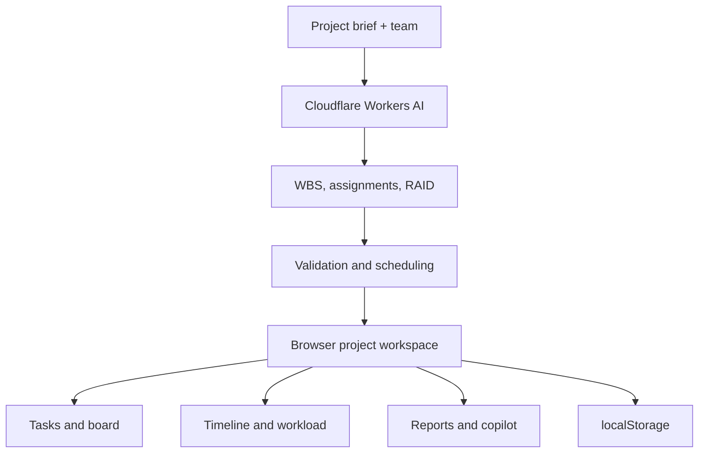

# AI Project Manager Assistant

[](https://workers.cloudflare.com/)
[](https://www.typescriptlang.org/)
[](https://ai-project-manager-assistant.madanmohanlearning.workers.dev/)

An AI-powered project delivery workspace built on Cloudflare Workers. Describe a project, add your team, and generate an actionable work breakdown structure with assignments, dependencies, milestones, workload insights, and a RAID register.

**[Try the live demo →](https://ai-project-manager-assistant.madanmohanlearning.workers.dev/)**

## Why this project?

Turning a project brief into an executable plan usually requires several rounds of task breakdown, sequencing, ownership, and risk analysis. AI Project Manager Assistant brings that workflow into one browser-based workspace:

- Generate a structured WBS from a project brief
- Assign tasks according to team roles and skills
- Track work across Backlog, To do, In progress, Review, and Done
- Visualize dependency-aware sequencing on a timeline
- Review team workload and capacity
- Maintain risks, assumptions, issues, and dependencies
- Create an executive status report and export the project as JSON
- Ask a project-aware AI copilot about blockers, priorities, and next steps

## Key features

| Area | What it provides |
| --- | --- |
| AI planning | 10–24 concrete tasks grouped into epics, with acceptance criteria and priorities |
| Scheduling | Validated task IDs and backward-only dependencies with deterministic start/end days |
| Delivery tracking | Task table, status controls, progress metrics, and Kanban-style board |
| Milestones | Epic completion milestones derived from the generated schedule |
| Team planning | Skill-aware assignments, task-day totals, and workload distribution |
| RAID | Risks, assumptions, issues, dependencies, owners, severity, and mitigation |
| Reporting | Executive status summary, clipboard copy, and complete JSON export |
| AI copilot | Project-context answers about risks, dependencies, workload, and recommended actions |
| Persistence | Zero-configuration browser storage through `localStorage` |

## How it works



The AI proposes the plan, but it does not control the final schedule. The Worker normalizes task IDs, rejects invalid or forward-pointing dependencies, calculates task dates, and derives milestones and workload metadata. This keeps the generated plan structurally consistent even when model output varies.

## Tech stack

- [Cloudflare Workers](https://developers.cloudflare.com/workers/)
- [Cloudflare Workers AI](https://developers.cloudflare.com/workers-ai/)
- TypeScript
- Vanilla JavaScript, HTML, and CSS
- Browser `localStorage`
- Wrangler

## Getting started

### Prerequisites

- Node.js 18 or later
- npm
- A Cloudflare account with Workers AI access

### Run locally

```bash
git clone https://github.com/MadanMohan0537/ai-project-manager-assistant.git
cd ai-project-manager-assistant
npm install
npx wrangler login
npm run dev
```

Open the local URL printed by Wrangler, normally `http://localhost:8787`.

### Validate the project

```bash
npm run check
```

This runs the TypeScript compiler and a Wrangler dry-run deployment.

### Deploy

```bash
npm run deploy
```

The included `wrangler.jsonc` configures:

- `AI` — Workers AI binding
- `ASSETS` — static assets from `public/`
- `AI_MODEL` — model used for planning and copilot requests

The default model is:

```text
@cf/meta/llama-3.1-8b-instruct-fp8
```

Change `AI_MODEL` in `wrangler.jsonc` to use another compatible Workers AI text-generation model.

## Using the app

1. Select **New project**.
2. Enter the objective, requirements, dates, delivery method, technology stack, and constraints.
3. Add team members with their roles, skills, and available capacity.
4. Generate the workspace.
5. Review and update tasks using the Tasks or Board view.
6. Inspect the timeline, team workload, RAID register, and executive report.
7. Open **Project Copilot** to ask questions about the current project.
8. Export the complete project state as JSON when needed.

## API

All API responses use JSON.

### Health check

```http
GET /api/health
```

Returns runtime health information and the configured model.

### Generate a project plan

```http
POST /api/projects/plan
Content-Type: application/json
```

Example request:

```json
{
  "name": "Customer Analytics Platform",
  "objective": "Launch an analytics platform for support leaders.",
  "description": "Build ingestion, authentication, dashboards, filters, and reporting.",
  "startDate": "2026-08-20",
  "targetDate": "2026-09-20",
  "methodology": "Agile",
  "stack": "TypeScript, Cloudflare Workers, D1",
  "constraints": "Small team and a fixed beta date.",
  "team": [
    {
      "name": "Alice",
      "role": "Frontend Engineer",
      "skills": "TypeScript, UI engineering, design systems",
      "capacity": 100
    }
  ]
}
```

The response contains the generated project, normalized tasks, schedule, milestones, RAID entries, workload data, and model name.

> `POST /api/run` remains available as a backward-compatible alias.

### Ask the project copilot

```http
POST /api/copilot
Content-Type: application/json
```

```json
{
  "question": "What is most likely to delay this project?",
  "project": {
    "id": "project-id",
    "name": "Customer Analytics Platform",
    "tasks": [],
    "raid": []
  }
}
```

The copilot uses the supplied project state and returns recommendations. It does not mutate project data.

## Project structure

```text
.
├── public/
│   ├── app.js          # Browser state, rendering, and interactions
│   ├── index.html      # Application shell
│   └── styles.css      # Responsive workspace UI
├── src/
│   └── index.ts        # Worker routes, AI prompts, validation, and scheduling
├── package.json
├── tsconfig.json
└── wrangler.jsonc      # Cloudflare bindings and deployment configuration
```

## Data and privacy

Projects are stored in the current browser's `localStorage`. They are not synchronized across browsers, devices, or users. Project context is sent to Workers AI when generating a plan or asking the copilot a question.

For a multi-user production deployment, add authentication and server-side persistence such as Cloudflare D1 with per-user project ownership.

## Current limitations

- Project persistence is browser-local and account-free.
- Board cards use status selectors instead of drag-and-drop.
- The timeline is dependency-aware, but it is not a complete critical-path or PERT engine.
- Capacity is displayed for planning context; the scheduler does not level resources automatically.
- Copilot suggestions must be applied manually.
- Automated tests are not yet included.

## Roadmap ideas

- Cloudflare D1 persistence and authentication
- Shared team workspaces and role-based access
- Drag-and-drop board interactions
- Resource-levelled scheduling and critical-path analysis
- Import/export integrations for common project-management tools
- Automated tests and CI validation

## Contributing

Contributions are welcome. Fork the repository, create a focused branch, run `npm run check`, and open a pull request describing the change and how it was verified.

## Acknowledgements

Built with Cloudflare Workers and Workers AI.
