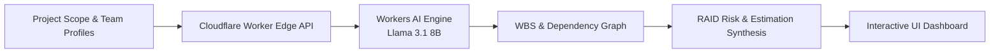

# 🤖 AI Project Manager Assistant

<p align="center">
  <strong>Serverless AI project planning copilot powered by Cloudflare Workers & Meta Llama 3.1.</strong>
</p>

<p align="center">
  <a href="#license"></a>
  <a href="https://workers.cloudflare.com"></a>
  <a href="https://www.typescriptlang.org"></a>
  <a href="https://developers.cloudflare.com/workers-ai/"></a>
</p>

---

## 📌 Overview

**AI Project Manager Assistant** is a full-stack, edge-deployed project planning engine built for Technical Program Managers and Project Managers. It converts loose project descriptions, target timelines, and team profiles into an actionable, structured execution plan with complete work breakdown structures (WBS), risk registers (RAID), and team task allocations.

Deployed natively on **Cloudflare Workers** with zero cold starts, the application leverages protected **Workers AI bindings (`@cf/meta/llama-3.1-8b-instruct-fp8`)** to synthesize comprehensive project plans with sub-second response times and zero database overhead.

---

## ✨ Key Features

- **🎯 Work Breakdown Structure (WBS) Generation:** Converts loose project scopes into hierarchical deliverables, epic themes, and granular task lists.
- **👥 Resource & Skill Allocation:** Maps project tasks to team members based on individual skill sets, seniority, and availability constraints.
- **⚠️ Automated RAID Risk Analysis:**
  - **Risks:** Technical blockers, scope ambiguities, third-party vendor dependencies.
  - **Assumptions:** Critical timeline dependencies and operational assumptions.
  - **Issues:** Immediate blockers requiring executive escalation.
  - **Dependencies:** Inter-team handoffs and cross-functional sequencing.
- **⏱️ Effort Estimation & Milestones:** Provides structured task duration estimates and critical milestone roadmaps.
- **🔒 Zero-Secret Serverless Architecture:** AI runs through protected Cloudflare Workers AI bindings without exposing API keys or credentials to client browsers.

---

## 🏗️ Architecture



---

## 🚀 Quick Start

### Prerequisites
- **Node.js:** v20+
- **Wrangler CLI:** `npm install -g wrangler`
- **Cloudflare Account:** (Free tier supported)

### Local Development

```bash
# Clone the repository
git clone https://github.com/MadanMohan0537/ai-project-manager-assistant.git
cd ai-project-manager-assistant

# Install dependencies
npm install

# Log in to Cloudflare
npx wrangler login

# Start local dev server
npm run dev
```

### Deployment

```bash
# Typecheck and validate
npm run check

# Deploy globally to Cloudflare Workers
npm run deploy
```

---

## 📡 API Reference

### `POST /api/run`

Generate a structured project plan from a scope description and team roster:

```json
{
  "project": "Build an enterprise customer feedback & sentiment dashboard",
  "team": [
    { "name": "Alice", "profile": "Lead Frontend Engineer — React, TypeScript, Tailwind" },
    { "name": "Bob", "profile": "Senior Backend Engineer — Node.js, Python, PostgreSQL" }
  ]
}
```

---

## 🛠️ Tech Stack

- **Runtime:** Cloudflare Workers (TypeScript)
- **AI Inference:** Cloudflare Workers AI (`@cf/meta/llama-3.1-8b-instruct-fp8`)
- **Frontend:** Responsive HTML5, Vanilla JavaScript, TailwindCSS
- **Tooling:** Wrangler, TypeScript

---

## 📄 License

MIT License — see [LICENSE](LICENSE) for details.
